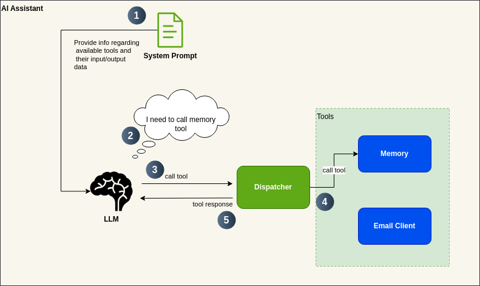
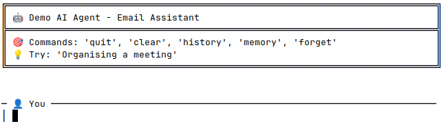

# 📧 Demo Application – Email Assistant

This project is a simple demo of an AI assistant designed for **composing and sending emails**. 

---

## 🎯 Project Goals

This demo demonstrates:

- ✅ How **tool calling** works with Large Language Models (LLMs) using just plain Java
- ✅ That building **agentic workflows** doesn't necessarily require Python or frameworks like LangChain
- ✅ How a few lines of integration code can enable powerful AI applications

---

## 🤖 Assistant Behavior

- 📨 Specializes in **email composition only**
- 🚫 Rejects unrelated queries with a clear reminder of its email-only focus
- ❓ Interactively asks for required email information:
    - Recipient's name and email (mandatory)
    - Sender's name (mandatory)
    - Category (e.g., appointment, meeting request)
    - Style (e.g., casual, formal)
    - Language and other optional details
- 💾 Uses a memory tool to **persist collected data**. It stores collected data in a file called 'memory.txt'
- ✅ Asks for user confirmation before sending an email:
  > _"Should I send the email now?"_

### Demo


---

## 💡 Notes

- 🔄 You're **not limited to the Claude API** for testing or using this example. However, the code was only tested with **Anthropic's Claude API**.
- ⚠️ The initial version of this code was **generated by an LLM**. It is for **educational/demo purposes only**.

---

## 📎 Related Content

- 📝 [LinkedIn Post 1](https://www.linkedin.com/feed/update/urn:li:activity:7346836264001679362/)
- 📝 [LinkedIn Post 2](https://www.linkedin.com/feed/update/urn:li:activity:7350048422332104704/)
---

## ⚙️ How Tool Calling Works



## 🎥 Demo


## 🧪 Usage

```shell
export CLAUDE_API_KEY="your-api-key-here"
javac DemoAgent.java
java DemoAgent
```

### 💬 Available Commands

| Command   | Description                          |
|-----------|--------------------------------------|
| `quit`    | Exit the assistant                   |
| `clear`   | Clear conversation history           |
| `history` | Display current conversation history |
| `memory`  | Show contents of the memory tool     |
| `forget`  | Clear all stored memory              |


